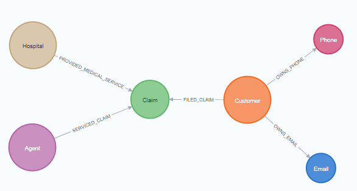

# Build a Health Claim ChatBot with OpenAI and Neo4j

## Description

This is a repository for a Claim Chatbot backed by neo4j graph database.

If you are new to `OpenAI`, `LangChain`, and `Neo4j`, please explore the learning resources here.

|OpenAI| LangChain | Neo4j |
|------|-----------|-------|
| [ChatGPT Prompt Engineering for Developers](https://www.deeplearning.ai/short-courses/chatgpt-prompt-engineering-for-developers/)| [LangChain for LLM Application Development](https://www.deeplearning.ai/short-courses/langchain-for-llm-application-development/) | [Neo4j Fundamentals](https://graphacademy.neo4j.com/courses/neo4j-fundamentals/) |
|[Building Systems with the ChatGPT API](https://www.deeplearning.ai/short-courses/building-systems-with-chatgpt/)| [LangChain: Chat with Your Data](https://www.deeplearning.ai/short-courses/langchain-chat-with-your-data/) | [Cypher Fundamentals](https://graphacademy.neo4j.com/courses/cypher-fundamentals/) |
|| [Functions, Tools and Agents with LangChain ](https://www.deeplearning.ai/short-courses/functions-tools-agents-langchain/)| [Graph Data Modeling Fundamentals](https://graphacademy.neo4j.com/courses/modeling-fundamentals/) |
|| | [Importing CSV data into Neo4j](https://graphacademy.neo4j.com/courses/importing-cypher/) |


## Installation

To run the application, you must install the libraries listed in `requirements.txt`.
```bash
pip install -r requirements.txt
```

## Setting up Neo4j Graph Database

Please follow the instruction in [Data Preparation](<data/Data Preparation.ipynb>) to create a graph database via `Neo4j Desktop` or `Neo4j AuraDB`


## Running the application

Pre-requisites: create a streamlit secret file in `.streamlit/secrets.toml` with following variables:

```bash
OPENAI_API_KEY = "sk-..."
OPENAI_MODEL = "gpt-4-turbo-preview"

NEO4J_URI="neo4j://localhost:7687 or Neo4j AuraDB io"
NEO4J_USERNAME="neo4j"
NEO4J_PASSWORD="<password>"
```


Then run the `streamlit run` command to start the app on [http://localhost:8501/](http://localhost:8501/)

```bash
streamlit run app.py
```

## Claim Data


## Claim Graph Database

```Cypher
call db.schema.visualization()
```

<p align="center">

</p>

All nodes and relationships

```Cypher
MATCH (c:Customer)-[:FILED_CLAIM]->(clm:Claim)<-[:PROVIDED_MEDICAL_SERVICE]-(h:Hospital),
      (a:Agent)-[:SERVICED_CLAIM]->(clm),
      (c)-[:OWNS_PHONE]->(p:Phone),
      (c)-[:OWNS_EMAIL]->(e:Email)
RETURN c AS Customer, p AS Phone, e AS Email, clm AS Claim, h AS Hospital, a AS Agent
```
<p align="center">

</p>

Filter by a node attribute

```Cypher
MATCH (c:Customer)-[:FILED_CLAIM]->(clm:Claim)<-[:PROVIDED_MEDICAL_SERVICE]-(h:Hospital),
      (a:Agent)-[:SERVICED_CLAIM]->(clm),
      (c)-[:OWNS_PHONE]->(p:Phone),
      (c)-[:OWNS_EMAIL]->(e:Email)
WHERE clm.claimId='C0001'
RETURN c AS Customer, p AS Phone, e AS Email, clm AS Claim, h AS Hospital, a AS Agent
```

Below is an example of nodes that are connected with a Claim node `C0001`. Clicking on a Claim node to show its attributes, which also include the embedding of `Narration`

<p align="center">

</p>


# Tech Stacks

**TBD**

## Agent Tools List

- **General Chat**
  - *Description*: For general chat about disease, illness and symptom
  - *Function*: `llm.invoke`
  - *Discription*: ..


- **Vector Search Index**
  - *Description*: Provides claims information based on narration using Vector Search
  - *Function*: `run_retriever`
  - *Discription*: ...


- **Graph Cypher QA Chain**
  - *Description*: Provides information about relationships among Customer, Claim, Agent, Hospital, Phone and Email.
  - *Function*: `run_cypher`
  - *Discription*: ..